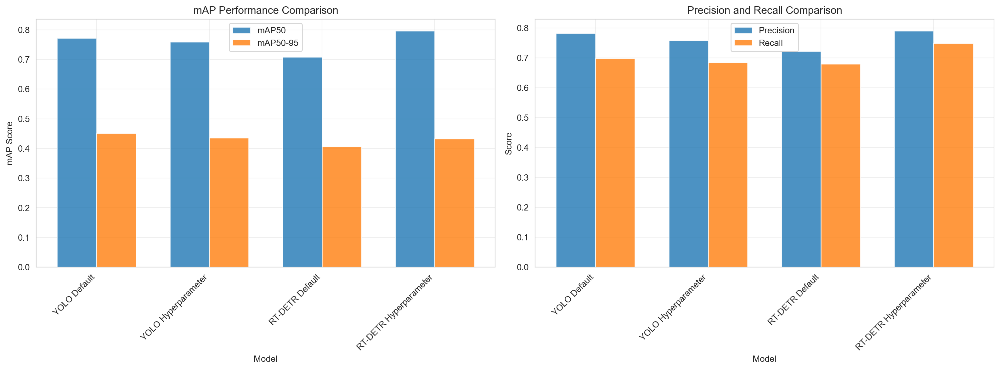
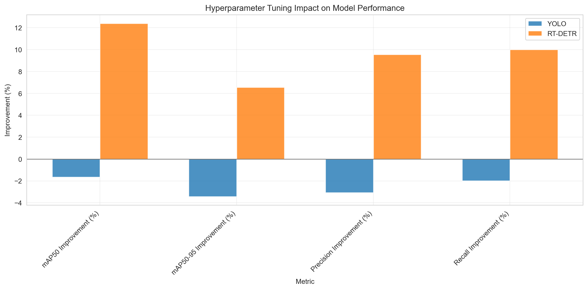

# 프로젝트: 화재·연기 탐지 (Fire & Smoke Detection)
- 작성자: 양인규, 김규민
- 작성일: 2025-11-30
- GPU 환경: RTX 5090, A100 GPU Cloud

# 1. 요약 (Executive Summary)
- 목적: 화재 및 연기 객체를 실시간으로 정확히 탐지하여 조기 대응 가능성 향상
- 주요 결과 (Validation 최종 Epoch 기준):
  - YOLO11n Default: mAP50=0.7717, mAP50-95=0.4512, Precision=0.7815, Recall=0.6976
  - YOLO11n Hyp: mAP50=0.7590, mAP50-95=0.4357, Precision=0.7575, Recall=0.6837 (튜닝으로 소폭 하락)
  - RT-DETR-L Default: mAP50=0.7085, mAP50-95=0.4062, Precision=0.7213, Recall=0.6802
  - RT-DETR-L Hyp: mAP50=0.7963, mAP50-95=0.4328, Precision=0.7901, Recall=0.7482 (튜닝으로 개선)
- 사용 모델: YOLO11n (경량 베이스라인), RT-DETR-L (Transformer 기반 고정밀)
- 데이터셋: Kaggle Smoke & Fire Detection (train=14122, val=3099, test=4306)
- 결론: RT-DETR 하이퍼파라미터 최적화가 가장 높은 재현율과 균형 잡힌 정확도 제공. YOLO는 빠르지만 튜닝 세트에서는 성능 하락 → 향후 증강/학습률 재검토 필요.

# 2. 배경 및 목표
- 화재 초기 연기 및 작은 불꽃을 빠르게 감지하는 경량/고정밀 모델 비교
- 성공 기준: mAP50 ≥ 0.75, Recall ≥ 0.70 (소실 검출 최소화)
- 제약사항: VRAM(로컬 6GB 한계), 라벨 품질(연기 경계 모호), 클래스 불균형 가능성

# 3. 데이터셋
- 출처: https://www.kaggle.com/datasets/sayedgamal99/smoke-fire-detection-yolo
- 구조: YOLO 포맷 (train / val / test)
- 클래스: ['smoke', 'fire']
- 통계: train=14122, val=3099, test=4306 (data.yaml 기준)
- 잠재 이슈: 연기 경계 불명확 → False Negative/Positive 혼재 가능
- 전처리: 리사이즈(640), 기본 정규화, GPU 캐시 옵션(off → 향후 'cache=ram' 고려)

# 4. 방법 (Methods)
## 4.1 모델
- YOLO11n: 경량, 빠른 추론, baseline 비교용
- RT-DETR-L: DETR 계열 실시간 변형, 복잡 객체/연기 패턴에 강점

## 4.2 학습 구성
- Epoch: 50 (두 모델 비교 동형 실험)
- Batch: 32 (로컬 4050 한계에 맞춤)
- ImgSz: 640
- Optimizer 스케줄: Ultralytics 기본(adam-like 내부 설정) / 하이퍼파라미터 lr0=0.002 적용 (RT-DETR hyp)

## 4.3 하이퍼파라미터 (hyp.yaml 주요)
- Augmentation: mosaic=1.0, mixup=0.15, copy_paste=0.3 (작은 객체/연기 가시성 증강)
- 기하학: degrees=10, translate=0.2, scale=0.7, fliplr=0.5 (현실적 범위)
- 색상: hsv_h=0.015, hsv_s=0.7, hsv_v=0.4 (조명/농도 다양화)
- 손실 가중치 (RT-DETR): box=7.5, cls=0.5, dfl=1.5 (작은 객체 박스 정밀도 강화)

# 5. 실험 (Experiments)
- 베이스라인: YOLO11n Default vs Hyp (동일 Epoch)
- 주 실험: RT-DETR-L Default vs Hyp (동일 Epoch)
- 비교 항목: mAP50, mAP50-95, Precision, Recall, 주요 train/val loss (box/giou, cls)

# 6. 결과 (Results)
## 6.1 Validation Metrics (최종 Epoch)
| 모델 | 설정 | mAP50 | mAP50-95 | Precision | Recall |
|------|------|-------|----------|-----------|--------|
| YOLO11n | Default | 0.7717 | 0.4512 | 0.7815 | 0.6976 |
| YOLO11n | Hyp | 0.7590 | 0.4357 | 0.7575 | 0.6837 |
| RT-DETR-L | Default | 0.7085 | 0.4062 | 0.7213 | 0.6802 |
| RT-DETR-L | Hyp | 0.7963 | 0.4328 | 0.7901 | 0.7482 |

### 6.1-1. 시각자료 (비교 노트북 산출물)

## 6.2 하이퍼파라미터 튜닝 영향 (Default → Hyp)
| 모델 | mAP50 Δ% | mAP50-95 Δ% | Precision Δ% | Recall Δ% |
|------|----------|-------------|--------------|-----------|
| YOLO11n | -1.65% | -3.44% | -3.06% | -1.99% |
| RT-DETR-L | +12.40% | +6.55% | +9.53% | +10.00% |

- 관찰: YOLO11n 튜닝이 과도한 증강/학습률 조합으로 수렴 둔화(정확도↓). RT-DETR는 증강이 작은 객체 일반화에 기여.

## 6.3 손실 추세 (개요)
- YOLO Box/Cls/Dfl Loss: 안정적 감소 → 후반 미세 개선
- RT-DETR GIoU/Cls/L1 Loss: Hyp 설정에서 후반 더 낮은 GIoU & L1 → 박스 정밀도 개선 반영 (Ultralytics RT-DETR 결과 CSV는 train/giou_loss, train/cls_loss, train/l1_loss 컬럼 기반)

참고: 비교 노트북(`results_comparison.ipynb`)에서 RT-DETR의 박스 손실 축은 YOLO의 `train/box_loss` 대신 RT-DETR의 `train/giou_loss`로 시각화되었습니다.

# 7. 분석 (Analysis)
- RT-DETR Hyp가 Recall +10% 확보 → 화재/연기 탐지 민감도 향상
- YOLO Hyp 성능 저하 원인 가설: mixup + copy_paste 동시 높은 적용률 → 클래스 경계 혼란 / 과증강
- Precision vs Recall: RT-DETR Hyp는 두 지표 모두 상승 (Threshold 재조정 여지 적음)
- 작은 연기 패턴: Transformer 인코더가 공간적 관계 학습에 유리

# 8. 배포 고려사항
- 추천 체크포인트: `rtdetr_fire_smoke/rtdetrv2_hyp/weights/best.pt`
- 형식 변환: Ultralytics → ONNX/TensorRT (추후 지연 시간 개선)
- 추론 임계값: conf ≥ 0.5, fire/smoke 각각 별도 threshold 튜닝 가능
- 처리량: YOLO11n > RT-DETR-L (속도 우위), 정밀도 필요 환경은 RT-DETR 권장

# 9. 한계 (Limitations)
- 연기 경계 애매 → 라벨 노이즈 가능성
- 야간/실내/산업 환경 데이터 부족 → 도메인 시프트 리스크
- 50 Epoch 제한: RT-DETR 더 긴 학습(100 Epoch) 시 추가 향상 잠재

# 10. 향후 과제 (Future Work)
- YOLO 재튜닝: mosaic 단계적 감소(close_mosaic 활용), mixup/ copy_paste 비율 하향
- 데이터 확장: 야간·실내·역광·안개 케이스 추가
- 비디오 기반 Temporal 안정화 (트래킹 + 누적 신뢰도)
- 경량 Distillation: RT-DETR → YOLO 변형 지식 증류로 속도·정밀도 절충

# 11. 재현성 (Reproducibility)
- 노트북: `yolov11n_default.ipynb`, `yolov11n_hyp.ipynb`, `rt-detrv2.ipynb`, `rt-detrv2_hyp.ipynb`, `results_comparison.ipynb`
- 설치: `pip install ultralytics gdown`
- 학습 예시 (YOLO Default): `model.train(data=data_yaml, epochs=50, imgsz=640, batch=32, name='yolo11n_default')`
- 학습 예시 (RT-DETR Hyp): `RTDETR('rtdetr-l.pt').train(data=data_yaml, cfg='fire_smoke_detection/hyp.yaml', epochs=50, imgsz=640, batch=32, project='rtdetr_fire_smoke_hyp', name='rtdetrv2_hyp')`
- 데이터 경로: `fire_smoke_detection/data.yaml`

부가 참고 자료:
- 하이퍼파라미터 파일: `fire_smoke_detection/hyp.yaml` (mosaic/mixup/copy_paste 등 증강과 `lr0` 설정 포함)
- 데이터 구성: `fire_smoke_detection/data.yaml` (클래스 및 split 경로 명시)

# 12. 부록 (Appendix)
- data.yaml 클래스/카운트 명시
- hyp.yaml 설정 (증강/학습률 가중치)
- 원시 results.csv: 각 폴더 내 최종 Epoch 행 참고

---

체크리스트:
- [ ] 작성자 이름 업데이트
- [ ] 필요시 Epoch 연장 실험 추가
- [ ] 이미지 시각화(성공/실패 사례) 첨부
- [ ] 배포 스크립트 정리
