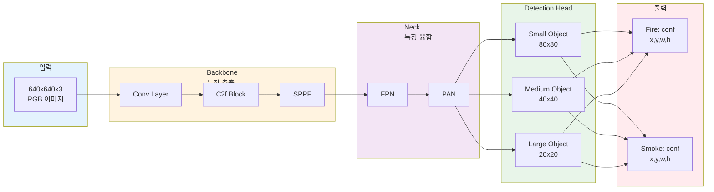
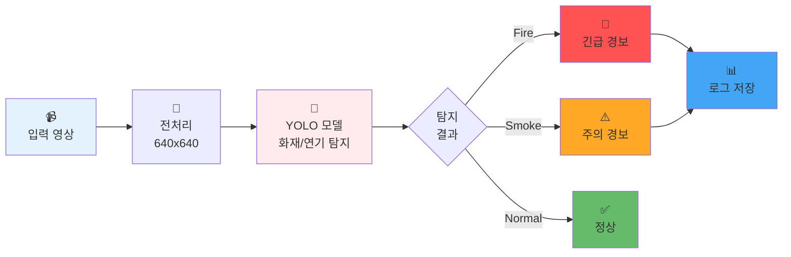
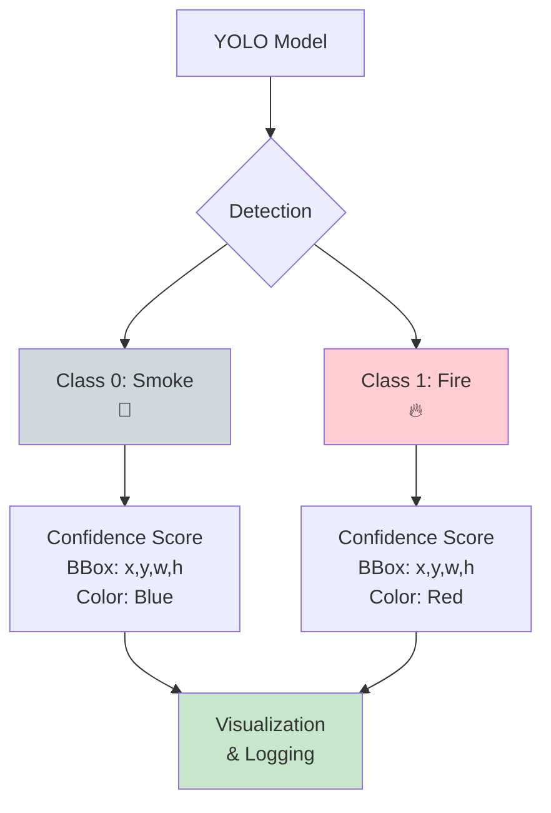
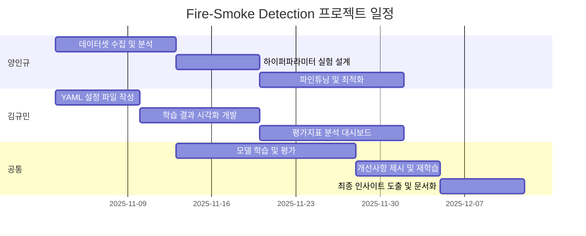

# 프로젝트 중간보고서

## 1. 프로젝트 개요

* 수행 학기: 2025년 2학기
* 프로젝트명: Fire-Smoke Detection
* 작성날짜: 2025-11-03

구분 | 성명  |    학번   |      소속학과    | 깃허브 아이디
----|-------|----------|-----------------|------------
1   | 양인규 | 20242402 | 데이터사이언스학과 | Inkyu-Yang356       
2   | 김규민 | 20230000 | 데이터사이언스학과 | KIMGM535

* 지도교수: 화성의과학대학교 김정은 교수님

## 2. 프로젝트 내용

### 2.1 서론

본 프로젝트는 지난 COEX AI 전시회에서 Computer Vision이 접목된 로봇, 스마트 공장 공정, 차세대 CCTV 시스템 등 AI 기술의 산업 적용 사례들을 경험하며, 인공지능이 환경문제 개선과 안전 분야에서 수행할 수 있는 중요한 역할에 주목하게 되었습니다. 특히 실시간 영상 분석 기술이 재난 예방과 조기 대응 시스템에 효과적으로 활용될 수 있다는 점에서 영감을 받았습니다.

최근 지구온난화와 기후변화로 인해 전 세계적으로 화재 발생 빈도가 급증하고 있으며, 이로 인한 인명 피해와 재산 손실, 산림 생태계 파괴가 심각한 사회 문제로 대두되고 있습니다. 특히 산불의 경우, 초기 대응 시간이 피해 규모를 결정하는 핵심 요인으로 작용하지만, 넓은 산림 지역을 전통적인 방법으로 감시하는 데는 한계가 있습니다. 이에 본 프로젝트는 YOLO 기반의 딥러닝 객체 탐지 기술을 활용하여 화재와 연기를 실시간으로 자동 탐지하는 시스템을 개발하고자 합니다.

본 프로젝트의 목적은 CCTV 영상이나 드론 카메라를 통해 수집되는 실시간 영상에서 화재(Fire)와 연기(Smoke)를 빠르고 정확하게 식별하여, 조기 경보 시스템을 구축함으로써 화재로 인한 피해를 최소화하는 것입니다. 최종 결과물로는 YOLOv8 또는 YOLOv11 모델 기반의 화재/연기 탐지 AI 모델과 이를 검증할 수 있는 성능 평가 시스템을 개발하며, 제한된 컴퓨팅 환경(노트북 GPU)에서도 실용적인 성능을 달성하는 학습 전략과 최적화 방법론을 연구합니다. 이를 통해 산림청, 소방서, 산업 시설 등에서 활용 가능한 실시간 화재 감시 보조 시스템의 기초 모델을 제시하고자 합니다.

### 2.2 추진 배경(자료조사 및 요구분석)  

#### 2.2.1. 개발 배경 및 필요성

최근 세계 곳곳에서 화재가 빈번하게 발생하며 광범위한 산림 수목 피해를 기록하고 있습니다. 주요 원인으로는 기후변화에 따른 불규칙한 날씨 패턴으로 인한 장기간 건조 상태 지속과, 넓은 산림 지역에서의 화재 조기 발견 실패로 인한 초동 대응 지연이 지목됩니다. 

산림청과 소방당국은 제한된 인력으로 광대한 산림 지역을 24시간 감시해야 하는 어려움을 겪고 있으며, 기존 센서 기반 화재 감지 시스템은 실외 환경에서 오작동이 잦고 반응 시간이 느려 초기 대응에 한계가 있습니다. 특히 야간이나 접근이 어려운 산악 지역에서는 육안 관찰이 불가능하여, 화재 발견 시점에 이미 피해가 확산된 경우가 많습니다.

이에 따라 CCTV나 드론을 활용한 실시간 영상 분석 기반의 자동 화재 탐지 시스템이 요구되며, AI 객체 탐지 기술을 통해 화재와 연기를 조기에 식별하여 신속한 대응을 가능하게 하는 시스템 개발이 필요합니다.

#### 2.2.2. 선행기술 및 사례 분석

**1) 관련 기술 동향**
- AI 기반 화재 탐지 기술이 전통적 센서 방식에서 Computer Vision 기반으로 전환 중
- YOLO, EfficientDet 등 실시간 객체 탐지 모델의 발전으로 현장 적용 가능성 증가
- 공공기관 및 산업계에서 AI 기반 화재 감시 시스템 연구 및 시범 운영 중

**2) 기존 유사 시스템 분석**
- **전통적 센서**: 연기/열 감지기는 실내용으로 반응 시간 30초~5분 소요, 실외 환경 부적합
- **상용 AI 시스템**: Bosch AVIOTEC($2,000+) 등 상용 제품이 존재하나 높은 비용과 폐쇄형 구조가 한계
- **학술 연구**: YOLO 계열 모델 기반 연구들이 화재/연기 탐지에서 mAP@0.5 70-85% 범위의 성능 보고

**3) 본 프로젝트의 특징 및 접근 방법**

| 구분 | 상용 시스템 | 본 프로젝트 (학술 연구) |
|------|-----------|----------|
| 목적 | 상용화 제품 | YOLO 모델 학습 및 성능 비교 분석 |
| 비용 | $2,000+ | 오픈소스 활용 (무료) |
| 데이터셋 | 자체 수집 대규모 | Kaggle 공개 데이터 (21,527장) |
| 학습 환경 | 전용 서버 / 클라우드 GPU | 개인 노트북 GPU (RTX 4050, 16GB RAM) |
| 연구 방향 | 최고 성능 달성 | 제한된 환경에서의 학습 과정 분석 |

**프로젝트 중점 사항:**
- 공개 데이터셋과 오픈소스 모델(YOLOv8/v11)을 활용한 학습 경험
- 제한된 컴퓨팅 자원 환경에서 효율적인 모델 선택 및 학습 전략 연구
- 하이퍼파라미터 변화에 따른 성능 차이 분석 및 인사이트 도출
- 실무 적용 가능성보다는 학습 과정의 이해와 성능 평가 방법론 습득에 초점

**4) 선행 연구 및 기술적 인사이트**
- YOLO 기반 화재/연기 탐지 연구들에서 mAP@0.5 기준 70-80% 수준의 성능 보고
- 작은 객체 탐지, 오탐률 개선, 다양한 환경 적응이 공통적인 연구 과제
- 실시간 처리와 정확도 사이의 trade-off 관계가 주요 이슈

**5) 차별점 및 개선 방향**

본 프로젝트는 선행 연구 대비 다음과 같은 차별점을 가집니다:

- **접근성**: 고가의 상용 시스템 대신 오픈소스 기반으로 누구나 재현 가능
- **실용성**: 제한된 노트북 환경(RTX 4050)에서도 학습 가능한 경량 모델 활용
- **비교 분석**: YOLOv8과 YOLOv11의 성능 및 효율성 직접 비교
- **투명성**: 전체 학습 과정과 실험 결과를 문서화하여 재현성 확보

개선 초점은 절대적 성능 수치보다 **학습 방법론의 이해**와 **제한된 자원 환경에서의 최적화 전략 도출**에 있습니다.

**6) 참고 자료**
- Kaggle, "Fire Detection Dataset", https://www.kaggle.com/datasets/phylake1337/fire-dataset (프로젝트 사용 데이터셋으로 실제 URL 확인 필요)
- Ultralytics, "YOLO11 Documentation", https://docs.ultralytics.com, 2024.
- Jocher, G. et al., "Ultralytics YOLO", GitHub repository, https://github.com/ultralytics/ultralytics, 2024.

### 2.3 목표 및 내용  

#### 2.3.1. 프로젝트 목표  *필수작성

본 프로젝트는 YOLO 기반 화재/연기 탐지 모델의 학습 과정을 체계적으로 수행하고 분석하는 것을 목표로 합니다. 구체적인 개발 목표는 다음과 같습니다:

**1) 학습 프로세스 수립**
- Kaggle 공개 데이터셋 수집 및 전처리 (21,527장)
- YOLOv8n/YOLOv11n 모델 비교 학습
- 하이퍼파라미터 실험 및 Fine-Tuning 전략 수립

**2) 모델 성능 달성**
- mAP@0.5: 70% 이상
- mAP@0.5:0.95: 40% 이상
- 제한된 노트북 환경(RTX 4050, 16GB RAM)에서 실용적 학습 시간 확보

**3) 분석 및 인사이트 도출**
- 학습 곡선 분석을 통한 과적합/과소적합 진단
- 성능 지표(Precision, Recall, mAP) 해석 및 개선 방향 제시
- YOLOv8 vs YOLOv11 성능 비교 분석
- 실험 결과의 재현성 확보를 위한 문서화

**4) 개발 환경 최적화**
- 경량 모델(nano 버전) 선택을 통한 학습 효율성 확보
- 하이퍼파라미터 조정에 따른 성능 변화 정량화
- 실무 적용 가능성 검토 및 개선 사항 도출

본 프로젝트는 최종 성능 수치보다 **학습 과정의 이해와 실험 설계 방법론 습득**에 중점을 두며, 제한된 자원 환경에서 효율적인 모델 개발 전략을 연구합니다.

#### 2.3.2. 개발 내용  *필수작성

**1) 개발 모델 및 데이터셋**

| 구분 | 내용 |
|------|------|
| **학습 모델** | YOLOv8n, YOLOv11n (경량 모델 비교) |
| **데이터셋** | Kaggle Fire-Smoke Detection Dataset (21,527장) |
| **클래스** | 2개 - Fire(화재), Smoke(연기) |
| **데이터 분할** | Train: 14,122장 / Val: 3,099장 / Test: 4,306장 |
| **이미지 크기** | 640x640 (YOLO 표준) |
| **학습 설정** | Epochs: 50, Batch: 16, 하이퍼파라미터: 기본값 |

**2) 최종 결과물의 형태**

본 프로젝트의 최종 결과물은 소프트웨어 기반 프로토타입으로, 다음 구성요소를 포함합니다:

- **학습된 AI 모델 파일**: YOLOv8n/v11n best.pt (최적 성능 모델)
- **Jupyter Notebook**: 전체 학습 과정 및 평가 코드
- **시각화 시스템**: Ground Truth 및 예측 결과 Bounding Box 시각화
- **성능 분석 대시보드**: 학습 곡선(Loss, mAP), Confusion Matrix

**3) 시스템 구성 및 주요 기능**

**핵심 기능:**
- 화재/연기 실시간 탐지 (신뢰도 임계값: 0.5)
- Bounding Box 기반 위치 식별
- 클래스별 색상 구분 (Fire: 빨강, Smoke: 파랑)
- 학습 과정 모니터링 (Loss, mAP@0.5, Precision, Recall)

**달성 목표:**
- mAP@0.5: 70% 이상
- mAP@0.5:0.95: 40% 이상
- 추론 속도: 실시간 처리 가능 수준

**4) 시스템 아키텍처**

**YOLO 모델 구조:**

**전체 시스템 흐름:**

**클래스별 탐지 구조:**

#### 2.3.3. 개발 환경

**하드웨어 환경:**
- GPU: NVIDIA RTX 4050 Laptop (6GB VRAM)
- RAM: 16GB DDR4
- Storage: SSD (학습 데이터 및 모델 저장)

**소프트웨어 환경:**
- OS: Windows 11
- 언어: Python 3.12
- 딥러닝 프레임워크: PyTorch, Ultralytics (YOLOv8/v11)
- 시각화: Matplotlib, OpenCV, Pillow
- 분석 도구: Pandas, Google Looker Studio
- 개발 환경: Jupyter Notebook, VS Code

#### 2.3.4. 현재 진행 결과 *필수작성

**YOLOv8n 학습 결과 (하이퍼파라미터 기본값):**

| 평가 지표 | 달성 값 | 목표 값 | 달성 여부 |
|---------|---------|---------|----------|
| mAP@0.5 | 76% | 70% 이상 | ✅ 달성 |
| mAP@0.5:0.95 | 44% | 40% 이상 | ✅ 달성 |
| 학습 시간 | ~2시간 (50 epochs) | - | - |
| 추론 속도 | 실시간 가능 | 실시간 처리 | ✅ 달성 |

**주요 성과:**
- 기본 하이퍼파라미터만으로도 목표 성능 달성
- 노트북 환경에서 안정적 학습 완료
- 과적합 없이 안정적인 학습 곡선 확인

**향후 계획:**
- YOLOv11n 모델 학습 및 비교 분석
- 하이퍼파라미터 튜닝을 통한 성능 개선 실험
- 오탐지/미탐지 케이스 분석 및 개선

### 2.4  기대효과  

본 화재 탐지 시스템은 산림청과 소방당국의 화재 감시 업무를 보조하여 광범위한 산림 지역의 24시간 모니터링을 가능하게 하며, 산지 인근 거주민들의 화재 불안감 해소에 기여할 수 있습니다.

경제적 측면에서는 조기 화재 탐지를 통한 신속한 초동 대응으로 산림 피해를 최소화하고, 산불로 인한 재산 손실 및 복구 비용을 대폭 절감할 수 있습니다. 사회적 측면에서는 인명 피해 예방과 산림 생태계 보호를 통해 지속 가능한 환경 관리에 기여하며, AI 기술의 공공 안전 분야 적용 사례로서 학술적 가치를 창출할 수 있습니다.

### 2.5  향후 계획 (프로젝트 일정)

### 2.6 역할 분담

구분 | 성명 | 팀내 역할 
:----:|:-----:|-------
1 | 양인규 | 데이터셋 수집, 하이퍼파라미터 및 파인튜닝 
2 | 김규민 | YAML 작성, 평가지표 시각화
3 |**공통**| 모델 학습 및 평가, 개선사항 제시, 인사이트 도출

### 2.7 참고문헌  

1. 저자, 제목, 교과목, ㅇㅇ대학, 연월. 
2. 저자, 제목, 출판사, 연월.
3. 저자, 제목, 저널명, 권, 호, 연월, 페이지.
4. 저자, 제목, 사이트/블로그명, 링크, 연월.  